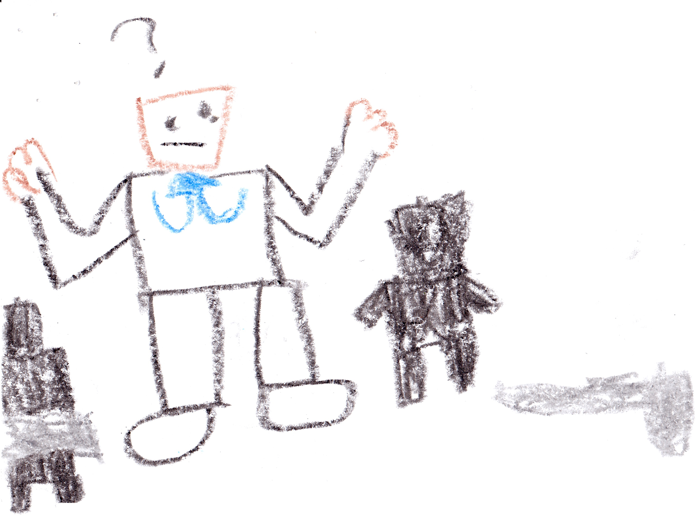

# Chapter 1: Malek's old friend {-}

Someone was running. Someone was panicking. His name was Ender. He led a company called the "E.N.D. Spies". Their job was to spy on bad guys, but right now he was being hunted and he was running because End Bot and three hunters were chasing him. Ender ran so fast that the bad guys didn't know where he went. Soon Ender came to an electric fence protecting our base.  Ender said, "Let me in! Let me in!” There was a security camera. I saw him over the security camera.  I said, "Malik you have to see this." Malik came and said, "That's Ender! Let him in!!"  I did.  We closed the door. When the three bad guys arrived, Alex put up the defenses. The bad guy in the middle said, "You don't scare ...!”

{width=600px}

Then, Clank!!! The other two bad guys dropped their weapons and ran away. "AAAAAAAAAAAA!!!!!!" screamed the other bad guy as he ran away. "That was easy," said  Ender. "Now tell us why you're here," I said. "I will," said Ender.

