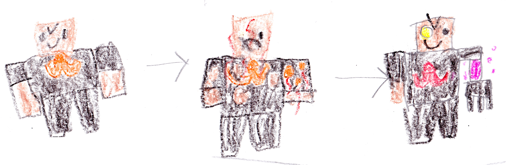

# Chapter 2: Ender’s story {-}

Everybody found a seat and sat down. 

I said, "Ender, I want to hear your backstory. What brought you here?" 

Ender said, "Well first, I made a network of undercover spies from The End. We call ourselves the E.N.D. Spies, and we infiltrated the bad guy gang. We know that Malek likes to spy on other bad guys." 

"Wait you did?" asked Malek. 

"We did. One day a bad guy named Armstrong figured out that Malek likes to spy on other bad guys. Armstrong ordered me to destroy Malek, but we escaped and blew up the base instead. Every bad guy died except Armstrong. Somehow Armstrong survived but he could no longer see out of his left eye, and he lost feeling in his right arm. His eye and arm were replaced with robot parts. Ever since that day all of our bases have been hunted. I am the only Survivor."

{width=600px}

Ender started to cry. 

I said, "Ender I'm sorry you can live with us." 

Felix said, "Beckett are you sure?"

"Yes I'm sure," I said.
