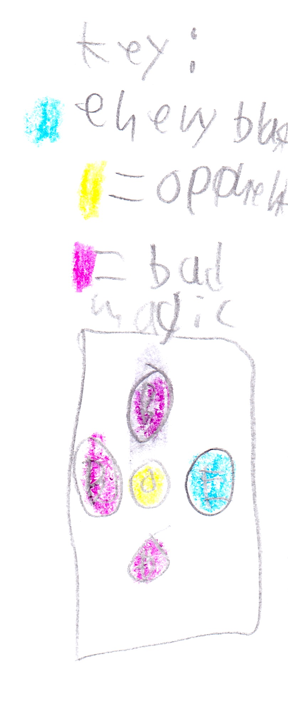

# Chapter 5: The Power!!! {-}

Ave called three more witches. Ave commanded, "Look in page 61 of The Witch Spells."

They found it and looked at the blueprint. The blueprint looked like this:

{width=200px}

They got ready to do the spell. 

Ave said to Endy, "This really hurts a lot -- remember that." 

Endy said, "Start," so they did. 

Endy screamed as he felt himself getting stronger and stronger and stronger. Soon his eyes turned red, and then the witches stopped. 

"How do you feel Endy?" asked Ave. 

"Ha-ha, perfect!" said Endy in an evil voice.

{width=600px}
