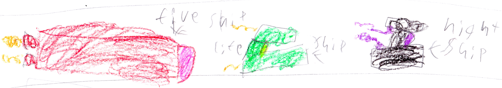

# Chapter 6: Our cool spaceships {-}

{width=600px}

*Meanwhile at my base...*

"I'm  done!!!" Alex said. 

We ran over. It was a spaceship for the Water, Fire, Night, and Life Gods. 

"Wow!" Everybody said. 

Alex said, "Oh that's nothing. come with me." 

My team walked down the hall and walked in a door and saw a big battleship. 

"What!!!" Everybody screamed. 

"I'm still working on it. It should be done by the end of this book," Alex said.  

I said, "Don't spoil the book.” 

Beep! beep! beep! 

"It's time for me to go on patrol. Bye everybody see you soon," I said. 

I got into the amazing Life Ship and flew away. 

Then, Ender came back from his time spying on the bad guys and said, "Where's Beckett?!?" 

"Oh, he just went on Patrol." 

"No," said Ender. 

"What?" asked Felix. 

Ender said, "Beckett is going to be..."

# Chapter 6 1/2: The plan {-}

Sorry that I had to interrupt that chapter but there is something I need to tell you:

*15 minutes earlier...*

The bad guy set up a meeting. King zombie said, "Endy, you said you had a plan."

"Yes," said Endy, "Instead of fighting Beckett’s whole team we will just fight Beckett. Then we will fight the rest of the team. Then we will suck the Life Gem's magic and use it to take over. Ha-ha-ha!"

"Great idea. To keep the good guys busy I will send Commander Armstrong," King Zombie said. He called Commander Armstrong and sent him to my base. Ender, who was spying, saw this all and ran away.

# Chapter 6 3/4: Our cool spaceships (in progress) {-}

...Hunted by Endy the Ender Dragon, King Zombie, and Ave the Witch! We need to find him and fast!!"

Everybody ran to their space ships. Alex opened the door when...

ZZZAP!!!! A blue ray shot down. Alex closed the door before it got inside. 

"Who did that?!?” Alex asked herself.
