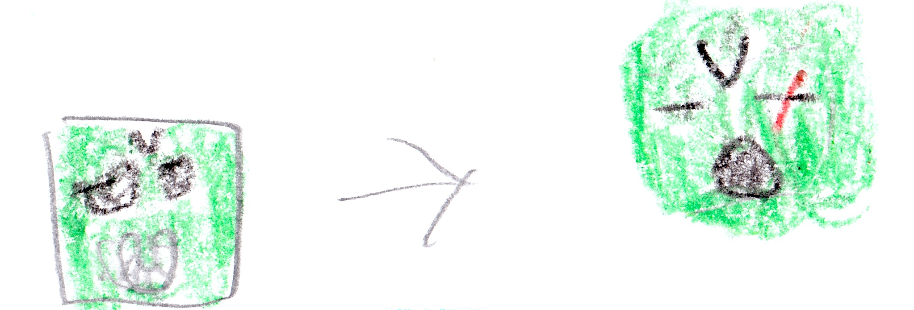

# Chapter 9: Big fight {-}

King Zombie crashed. When he woke up he saw Felix.

"Well, well, well, look who's here," King Zombie said.

"I am here to finish the job -- soon you will be no more," said Felix. 

Felix turned into the Fire God. King Zombie got out his fire sword. They fought. Felix wasn't getting anywhere but he was dodging all King Zombie's attacks. Then he formed the fireball shooter and shot fireballs. King Zombie dodged all of these. But one of them hit his sword. Felix kept firing more and more fireballs at King Zombie's sword. Then the fire sword flew out of King Zombie's hands. "No!" King Zombie said. Felix and King Zombie raced to get the sword. Felix got it first. Then he slashed King Zombie's head, but King Zombie survived. Felix said, "I win," and he walked away. 

{width=600px}

Ave came and helped King Zombie up. Armstrong, Ave, and King Zombie went away. But Endy stayed to finish the job 